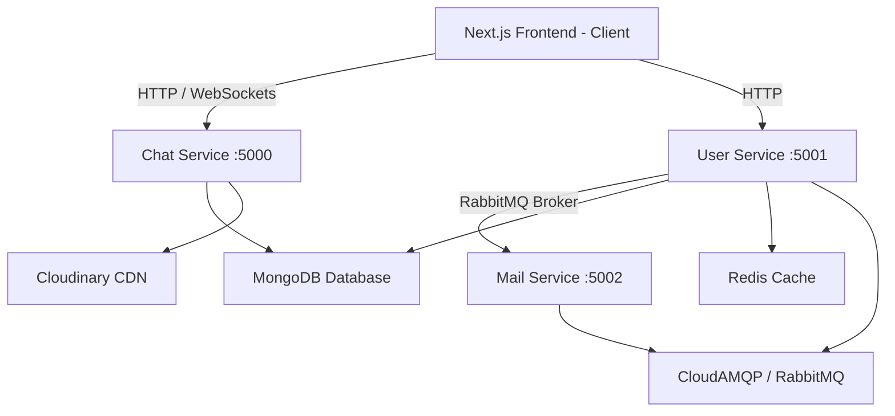

# Chatify: Scalable MERN & Microservices Real-Time Chat Application

**Chatify** is a production-ready, feature-rich real-time messaging and communication application built using Next.js, a Node.js microservices backend, and WebRTC. It utilizes RabbitMQ for asynchronous service-to-service communication, Redis for caching, and Socket.IO for real-time signaling.

---

## 🚀 Key Features

*   💬 **Real-time Chatting:** Low-latency text messaging powered by WebSockets (Socket.IO).
*   🎙️ **Voice Messaging Support:** Record, preview, and play back voice notes. Voice recordings are uploaded to Cloudinary asynchronously, leveraging an **Optimistic UI Update** model for instant client-side rendering.
*   📞 **P2P Voice & Video Calling:** Peer-to-peer audio and video calls established via **WebRTC** (`RTCPeerConnection` with Google STUN servers) utilizing socket-based signaling.
*   ⚡ **Optimistic UI Updates:** Messages immediately appear in the feed with a loading indicator (pulsing clock icon) and lower opacity while uploads/saves complete in the background.
*   📧 **OTP Email Authentication:** Dynamic OTP generation. Registration initiates background email notifications processed asynchronously through a **RabbitMQ** mail consumer.
*   🟢 **Online Status & Typing Indicators:** Real-time presence indicators and active typing feedback.
*   🗂️ **Cloud Media Storage:** Direct media hosting for photos and voice notes integrated with **Cloudinary**.

---

## 🏗️ Architecture Design



### Microservices Breakdown
1.  **`chatFrontend` (Next.js client):** Thin, declarative pages using custom React hooks to separate business logic and UI presentation.
2.  **`user` service (Port 5001):** Manages user registration, JWT logins, active session tokens, and emits OTP triggers to RabbitMQ.
3.  **`chat` service (Port 5000):** Manages real-time WebSockets, group/private chat rooms, and processes media/audio files using dynamic Multer storage.
4.  **`mail` service (Port 5002):** A background RabbitMQ consumer dedicated to dispatching OTP authentication emails using SMTP.

---

## 🛠️ Tech Stack

*   **Frontend:** Next.js (App Router), React, Lucide Icons, Moment.js
*   **Backend:** Node.js, Express, TypeScript, Multer, Cloudinary
*   **Databases & Caching:** MongoDB (Mongoose), Redis
*   **Broker & Real-time:** RabbitMQ, Socket.IO, WebRTC (Native API)

---

## 🔧 Environment Variables Reference

### User Service (`user/.env`)
```env
PORT=5001
MONGO_URI="your_mongodb_connection_string"
JWT_SECRET="your_jwt_secret"
REDIS_URL="redis://localhost:6379"
Rabbitmq_Host=localhost
Rabbitmq_Username=guest
Rabbitmq_Password=guest
```

### Chat Service (`chat/.env`)
```env
PORT=5000
MONGO_URI="your_mongodb_connection_string"
JWT_SECRET="your_jwt_secret"
USER_SERVICE=http://localhost:5001

# Cloudinary Config
Cloud_Name="your_cloudinary_name"
Api_Key="your_cloudinary_api_key"
Api_Secret="your_cloudinary_api_secret"
```

### Mail Service (`mail/.env`)
```env
PORT=5002
RABBITMQ_URL="amqp://localhost"
SMTP_USER="your-email@gmail.com"
SMTP_PASS="your-app-password"
```

### Client Frontend (`chatFrontend/.env`)
```env
NEXT_PUBLIC_CHAT_SERVICE_URL=http://localhost:5000
NEXT_PUBLIC_USER_SERVICE_URL=http://localhost:5001
```

---

## 🏃 Local Setup Guide

### 1. Start Middleware (Docker)
Ensure Docker is installed and running, then start Redis and RabbitMQ:
```bash
# Run RabbitMQ
docker run -d --name rabbitmq -p 5672:5672 -p 15672:15672 rabbitmq:3-management

# Run Redis
docker run -d --name redis -p 6379:6379 redis:alpine
```

### 2. Install Dependencies
Run `npm install` inside the root of each project folder (`user`, `chat`, `mail`, `chatFrontend`).

### 3. Build & Run Services
Open four separate terminal windows and start the development servers:

*   **User Microservice:**
    ```bash
    cd user
    npm run dev
    ```
*   **Mail Microservice:**
    ```bash
    cd mail
    npm run dev
    ```
*   **Chat Microservice:**
    ```bash
    cd chat
    npm run dev
    ```
*   **Frontend Client:**
    ```bash
    cd chatFrontend
    npm run dev
    ```

Access the application at `http://localhost:3000`.

---

## ☁️ Deployment Guide

For details on deploying the databases, message brokers, backend services, and Next.js frontend completely for free, refer to the [Deployment Walkthrough Guide](file:///C:/Users/VINAYAK%20MAHESHWARI/.gemini/antigravity/brain/2402bfe6-9da8-43bc-b0b5-980645b7866d/artifacts/deployment_guide.md).
